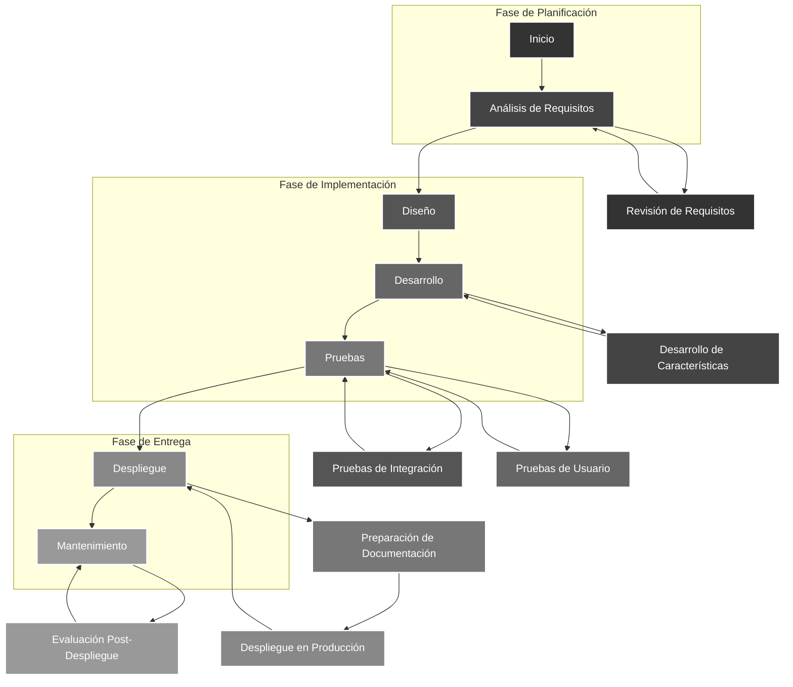

<!--
CREACION DE NOTAS, DESCRIPCIONES, OBSERVACIONES Y "PLANES DE MEJORA"
-->
<!--
=================Contenido=======================
nota:

-->

  

<h1 align="center">💻 Soy Andres Jimenez 💻</h1>

  <a href="https://www.linkedin.com/in/andres-jimenez-01749322b/" target="_blank">Visita mi LinkedIn</a>

<!-- 
DESCRIPCION PERSONAL
-->

## 🍕Sobre mi.  
Estudiante de Ingeniería de Sistemas con sólidos conocimientos en **matemáticas, programación ***( ⚙ Java, Python, php, javascript )*** , bases de datos, redes de  comunicación, inteligencia artificial y arquitectura del computador.** 👾 Enfoque en resolver problemas eficientemente y crear soluciones innovadoras con impacto social.✅ Soy proactivo, con fuertes habilidades interpersonales y preparado para enfrentar desafíos profesionales con confianza, contribuyendo significativamente  en cualquier entorno laboral. 📌

<!--
LISTA DE DATOS PERSONALES
-->
+ 🔬: Soy un verdadero amante de la ciencia
+ 💡: Me interesa todo lo relacionado con los datos: Big Data, Cloud, Machine Learning y Data Science.
+ ❤️: Mi lenguaje favorito: Python, JavaScript, SQL
+ 😃: Espero colaborar en proyectos impactantes.
+ 🎯: Actualmente me estoy centrando en : python
+ 🌱: Actualmente estoy aprendiendo Redes Neuronales y Deep Learning. 🧠💻
+ 🍕: Visita mi perfil [DEV.to](https://dev.to/andres0usb)
+ 🤔: ¡Estoy buscando ayuda con cualquier cosa que esté aprendiendo actualmente! 😅
+ 💬: Pregúntame sobre algoritmos de Análisis de Datos, Visualización y Machine Learning. 📊📈
+ 👩🏻‍💻: Soy un desarrollador web y de aplicaciones con esperanza 
+ 🌟: Pasatiempos: Artículos📕 y Música 🎧 
+ 🛠️: Actualmente estoy abierto para: Una pasantía o una nueva oportunidad laboral
+ ✉¡Deja tu comentario sobre mi perfil como desarrollador! 👉[AQUI](https://github.com/andres0usb/andres0usb/issues/1). 

<!--
LENGUAJES & TECNOLOGIAS APRENDIDAS
-no modificar por ahora, solo si tienes tiempo
-->
### Lenguajes y tecnologias

<table style="border: 0px solid #ddd; padding: 10px; margin-bottom: 10px; width: 100%;">
  <tr>
    <td style="width: 50%; vertical-align: top;">
      <h4 align="left">Core Skills:</h4>
      

        
        
        
        
        
        
        
        
        
        
        
      

      <h4 align="left">Cloud</h4>
      

        
      

    </td>
    <td style="width: 50%; vertical-align: top;">
      <h4 align="left">FRONTEND</h4>
      

        
        
        
        
        
      

      <h4 align="left">BACKEND AND DATABASE</h4>
      

        
        
        
        
        
      

    </td>
  </tr>
  <tr>
    <td style="width: 50%; vertical-align: top;">
      <h4 align="left">Software</h4>
      

        
      

    </td>
    <td style="width: 50%; vertical-align: top;">
      <h4 align="left">CMS</h4>
      

        
        
      

    </td>
  </tr>
  <tr>
    <td style="width: 50%; vertical-align: top;">
      <h4 align="left">Otros</h4>
      

        
        
        
        
        
        
        
        
         

      

    </td>
    <td style="width: 50%; vertical-align: top;">
      <h4 align="left">Code editor</h4>
      

        
      

    </td>
  </tr>
</table>
 

<!--
Resaltar las habilidades profesionales y personales
-->
> [!IMPORTANT]
> ## HABILIDADES
> | 💻 Profesional               | 📚 Personal             |
>|------------------------------|-------------------------|
>| + Habilidades de programación| + Pensamiento crítico   |
>| + Manejo de tecnologías      | + Pensamiento analítico |
>| + Excel                      | + Organización          |
>| + Análisis de datos          | + Autogestión           |
>| + Base de datos              | + Adaptabilidad         |
>| + Desarrollo de soluciones   | + Nivel de inglés       |
>

 

<!--
Diagrama
-->

### Mi Flujo de Trabajo

<!--
ANALITICAS DE GITHUB
-->

<!--
REDES SOCIALES Y PLATAFORMAS
-->
<h3 align="left">Connect with me:</h3>

> [!NOTE]
>
> 💾 Para mi la informacion es de las cosas mas importante que tenemos en nuestra actualidad
>### 📑¡Deja tu comentario sobre mi perfil como desarrollador!👉[AQUI](https://github.com/andres0usb/andres0usb/issues/1). 
>  
