  

<h1 align="center">💻 Soy Andres Jimenez 💻</h1>

Desarrollador de Software

  <a href="https://www.linkedin.com/in/andres-jimenez-01749322b/" target="_blank">Visita mi LinkedIn</a>

### Mi Flujo de Trabajo Complejo

```mermaid
graph TD
    A[Raíz] --> B[Nodo 1]
    A --> C[Nodo 2]
    B --> D[Nodo 1.1]
    B --> E[Nodo 1.2]
    C --> F[Nodo 2.1]
    C --> G[Nodo 2.2]

```

