### Mi Tarjeta de Perfil

    

        
        <h1 style="margin: 0; font-size: 24px; color: #fff;">💻 Soy Andres Jimenez 💻</h1>
        
Desarrollador de Software

        <a href="https://www.linkedin.com/in/andres-jimenez-01749322b/" target="_blank" style="text-decoration: none; color: #007bff; font-size: 16px; display: inline-block; margin-top: 10px;">Visita mi LinkedIn</a>
    

### Gráfico de Barras con Mermaid

```mermaid
graph LR
    A[Inicio] --> B{Decisión}
    B -->|Sí| C[Acción 1]
    B -->|No| D[Acción 2]
    C --> E[Fin]
    D --> E[Fin]
```

