    
    <h1>💻 Soy Andres Jimenez 💻</h1>
    
Desarrollador de Software

    <a href="https://www.linkedin.com/in/andres-jimenez-01749322b/" target="_blank">Visita mi LinkedIn</a>

### Gráfico de Barras con Mermaid
### Mi Flujo de Traba

```mermaid
graph TD
    A[Inicio] --> B[Análisis de Requisitos]
    B --> C[Diseño]
    C --> D[Desarrollo]
    D --> E[Pruebas]
    E --> F[Despliegue]
    F --> G[Mantenimiento]

    subgraph "Fase de Planificación"
        A;
        B;
    end

    subgraph "Fase de Implementación"
        C;
        D;
        E;
    end

    subgraph "Fase de Entrega"
        F;
        G;
    end

    B --> H[Revisión de Requisitos]
    H --> B

    D --> I[Desarrollo de Características]
    I --> D

    E --> J[Pruebas de Integración]
    J --> E
    E --> K[Pruebas de Usuario]
    K --> E

    F --> L[Preparación de Documentación]
    L --> M[Despliegue en Producción]
    M --> F

    G --> N[Evaluación Post-Despliegue]
    N --> G

    style A fill:#f9f,stroke:#333,stroke-width:2px;
    style B fill:#bbf,stroke:#333,stroke-width:2px;
    style C fill:#afa,stroke:#333,stroke-width:2px;
    style D fill:#fea,stroke:#333,stroke-width:2px;
    style E fill:#8e8,stroke:#333,stroke-width:2px;
    style F fill:#88f,stroke:#333,stroke-width:2px;
    style G fill:#fbb,stroke:#333,stroke-width:2px;
    style H fill:#f9f,stroke:#333,stroke-width:2px;
    style I fill:#bbf,stroke:#333,stroke-width:2px;
    style J fill:#afa,stroke:#333,stroke-width:2px;
    style K fill:#fea,stroke:#333,stroke-width:2px;
    style L fill:#8e8,stroke:#333,stroke-width:2px;
    style M fill:#88f,stroke:#333,stroke-width:2px;
    style N fill:#fbb,stroke:#333,stroke-width:2px;

```

